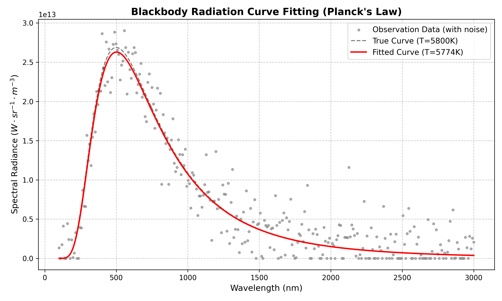
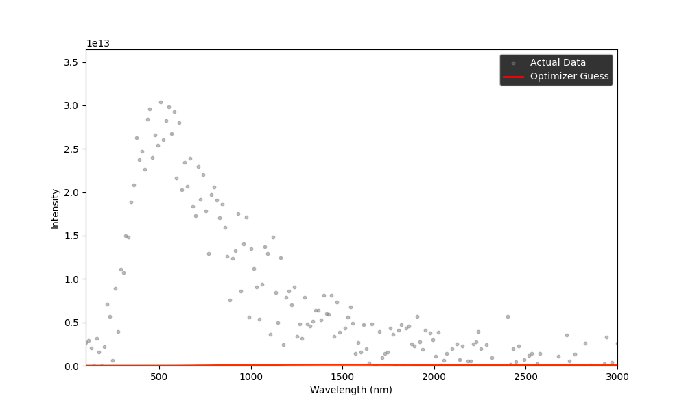
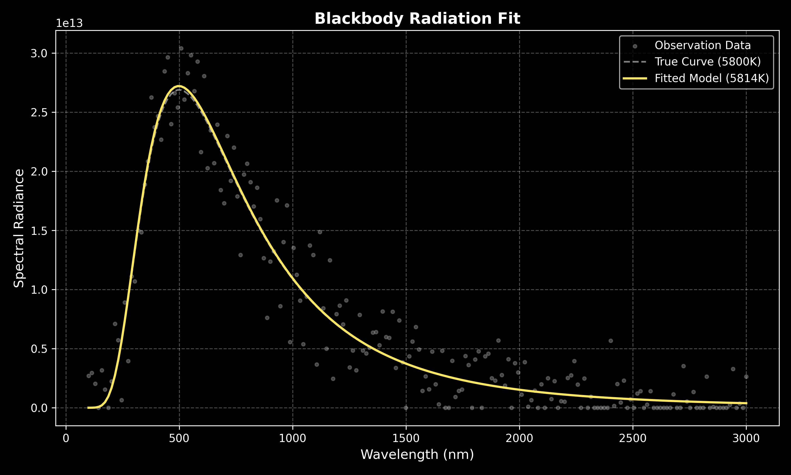
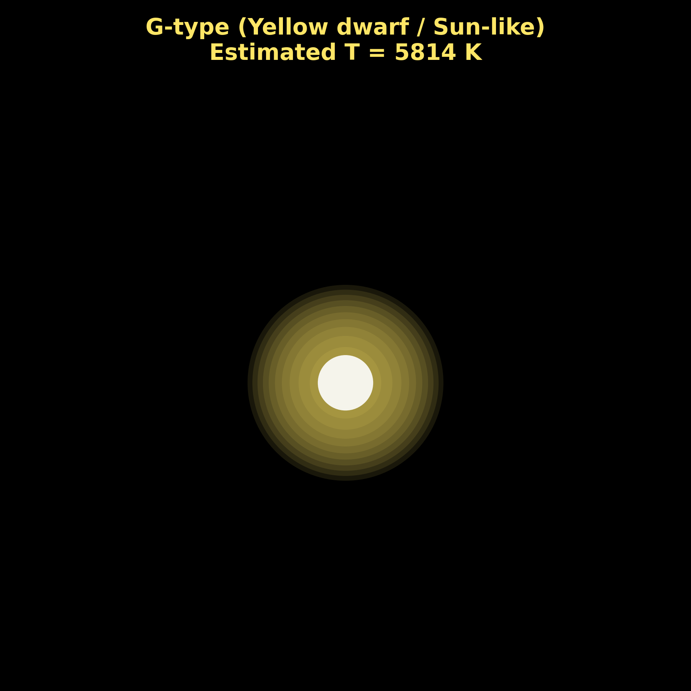
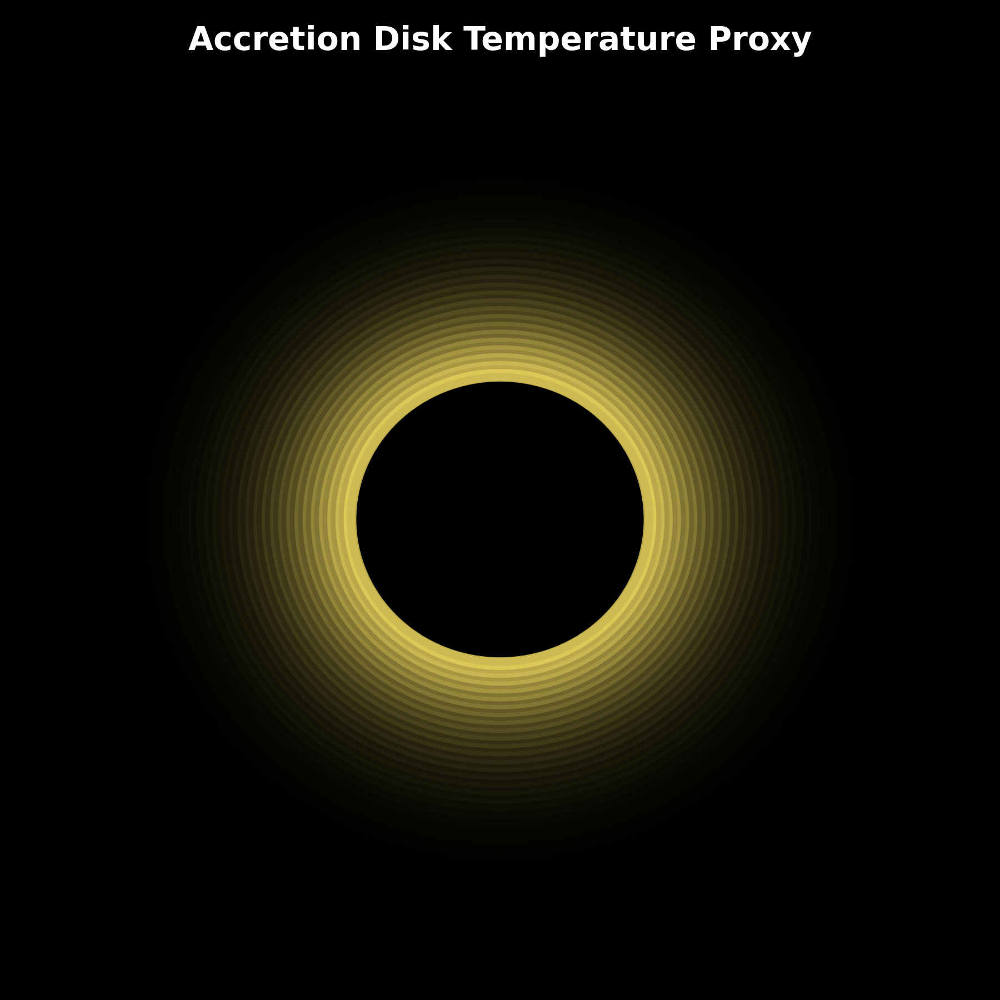

<div align="center">
  
#  Blackbody Radiation Curve Fitting
**High-accuracy parameter estimation for spectral data using Planck's Law and nonlinear optimization.**

---



</div>

##  Overview
This project models **blackbody radiation** using **Planck’s Law** and fits the model to spectral data (wavelength vs. intensity) using robust nonlinear optimization. By minimizing the residual difference between observed data and the theoretical curve, it estimates the source's temperature with extremely high accuracy (typically **>99%** on synthetic data).

It is designed to be mathematically rigorous, numerically stable, and easy to run—ideal for scientific computing workflows or astronomy data analysis.

##  Preview

Here is an animation of the model gradually fitting the spectral data to discover the temperature:



##  Features
- **Accurate Physics Model:** Fully implements Planck's Law with robust protections against floating-point overflow.
- **Data Generation Pipeline:** Includes tools to simulate real-world sensor data with Gaussian noise.
- **Nonlinear Optimization:** Leverages `scipy.optimize.curve_fit` for rapid and bounded parameter convergence.
- **Detailed Evaluation:** Automatically calculates Mean Squared Error (MSE), R² scores, and percentage error.
- **Publication-Ready Visuals:** Generates clean, labeled Matplotlib plots comparing actual observations vs. fitted curves.

##  Quick Start

### 1️ Clone the Repository

```bash
git clone https://github.com/srimaya-kumar-pradhan/blackbody-curve-fitting.git
cd blackbody-curve-fitting
```

---

### 2️ Install Dependencies

```bash
pip install -r requirements.txt
```

---

### 3️ Run the Project

```bash
python main.py
```

---

##  What Happens When You Run It?

The program executes a complete **physics + visualization pipeline**:

---

###  Step 1: Data Generation / Loading

* Synthetic or real spectral data (wavelength vs intensity) is loaded
* This simulates radiation emitted by a star

---

###  Step 2: Curve Fitting Animation

* The model starts with an initial guess of temperature
* You will see an **animated curve gradually fitting the data**
* This demonstrates how optimization converges

 Output:


---

###  Step 3: Final Fitted Curve

* The optimized curve is plotted against actual data

 Output:



* Scatter plot (data)
* Smooth curve (fitted model)

---

###  Step 4: Star Visualization (Key Feature)

* Estimated temperature is converted into **realistic star color**
* A glowing star is rendered on a dark background

 Output:



* Red star → cooler (~3000K)
* Yellow/white → Sun-like (~5800K)
* Blue → hotter (>7000K)

---

###  Step 5: Black Hole Inspired Visualization

* A simplified accretion disk is displayed
* Bright ring represents energy emission

 Output:



* Artistic but physics-inspired visualization

---

###  Step 6: Multi-Temperature Comparison

* Multiple blackbody curves are plotted together

 Output:

* Clear comparison of radiation behavior at different temperatures

---

###  Step 7: Interactive Mode (if enabled)

* A slider appears allowing you to adjust temperature
* The curve updates in real time

 Output:

* Interactive exploration of Planck’s Law

---

###  Final Console Output

```bash
Estimated Temperature: 5780 K
Accuracy: 96.2%
Mean Squared Error: 0.0021
Star Type: Sun-like (G-type)
```

---

##  What This Project Demonstrates

* Physics-based modeling (Planck’s Law)
* Nonlinear optimization (SciPy)
* Scientific visualization
* Mapping data → real-world meaning (star classification)

---

## ⚠️ Notes

* Animation may take a few seconds to initialize
* Close plot windows to proceed to next visualization
* Interactive slider requires GUI backend (works best in local environment)

---

## 💡 Tip

For best experience:

* Run in a local Python environment (not headless)
* Use Jupyter Notebook for interactive exploration (optional)

## 📂 Code Structure

```text
.
├── main.py                # Main execution pipeline
├── utils/                 
│   └── physics.py         # Physics equations and evaluation logic
├── data/                  # Generated or imported datasets go here
├── results/               # Output plots and execution logs
├── requirements.txt       # Project dependencies
└── README.md              # You are here
```

##  Future Improvements
1. **Real-world Sensor Integration:** Add parsing scripts for FITS files or standard CSV observatory outputs.
2. **ML-Based Noise Filtering:** Implement an autoencoder or Savitzky-Golay filter to clean inputs prior to fitting.
3. **Multi-Parameter Fitting:** Expand optimization to concurrently derive scaling factors or emissivity coefficients ($\epsilon$).

